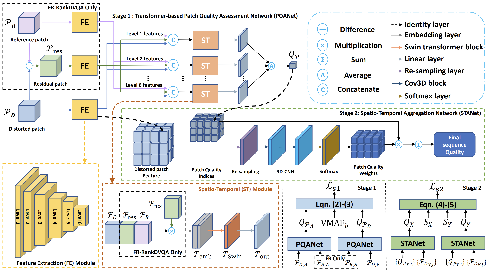

# RankDVQA: Deep VQA based on Ranking-inspired Hybrid Training

RankDVQA: Deep VQA based on Ranking-inspired Hybrid Training, <br>
 [Chen Feng](https://chenfeng-bristol.github.io/) <sup>1</sup>,
 [Duolikun Danier](https://danier97.github.io/)<sup>1</sup>,
 [Fan Zhang](https://fan-aaron-zhang.github.io/) <sup>1</sup>,
 [David Bull](https://david-bull.github.io/) <sup>1</sup>, <br>
 <sup>1</sup>Visual Information Laboratory, University of Bristol, Bristol, UK, BS1 5DD

in IEEE/CVF Winter Conference on Applications of Computer Vision (WACV) 2024.

### [Paper](https://openaccess.thecvf.com/content/WACV2024/papers/Feng_RankDVQA_Deep_VQA_Based_on_Ranking-Inspired_Hybrid_Training_WACV_2024_paper.pdf) | [Project](https://chenfeng-bristol.github.io/RankDVQA/) 


We propose new VQA methods based on a two-stage training methodology which motivates us to develop a large-scale VQA training database without employing human subjects to provide ground truth labels. This method was used to train a new transformer-based network architecture, exploiting the quality ranking of different distorted sequences rather than minimizing the difference from the ground-truth quality labels. The architecture of RankDVQA consists of two parts: the PQANet, which uses convolutional and SWIN transformer layers for feature extraction and local quality prediction, and the STANet, which refines the assessment using adaptive spatio-temporal pooling.

### Framework
 

### Requirements
Python==3.8.6

Pytorch version: >= Pytorch1.10

GPU memory: >= 16G

### Proposed training datasets

Please fill the [registration form](https://forms.office.com/e/5QeYmKsZzA) to get access to the download link. I will then share the download link ASAP.

### Training 
1. Download the RankDVQA dataset (Please fill the [registration form](https://forms.office.com/e/5QeYmKsZzA)). 

2. Stage1: Run the training codes of PQANet
```bash
python train.py --model=multiscale_v33 --expdir=./models/
```
3. Extract the feature and predicted scores from PQANet
```bash
cd STANet
python data_generation.py --json_path=./path_to_database_json_file.json
```
4. Stage2: Run the training codes of STANet
```bash
python train.py --pretrained_model_path=./models/FR_model --data_path=./data_VMAFplus.pkl --save_path=./exp/stanet/ 
```

### Usage
1. Run the testing code of PQANet: 
```bash
python test.py --database=./path_to_database/ --width=1920 --height=1080 --bitDepth=8
```

2. Run the testing code of STANet:
```bash
cd STANet
python test.py --model_path=./exp/stanet/stanet_epoch_20.pth --json_path=./path_to_database_json_file.json
```


## Citation
```
@InProceedings{Feng_2024_WACV,
    author    = {Feng, Chen and Danier, Duolikun and Zhang, Fan and Bull, David},
    title     = {RankDVQA: Deep VQA Based on Ranking-Inspired Hybrid Training},
    booktitle = {Proceedings of the IEEE/CVF Winter Conference on Applications of Computer Vision (WACV)},
    month     = {January},
    year      = {2024},
    pages     = {1648-1658}
}
```

If you find any bugs in the code, feel free to send me an email: chen.feng@bristol.ac.uk. 

## Acknowledgments
The authors appreciate the funding from the UKRI MyWorld Strength in Places Programme (SIPF00006/1), the University of Bristol, and the China Scholarship Council.
